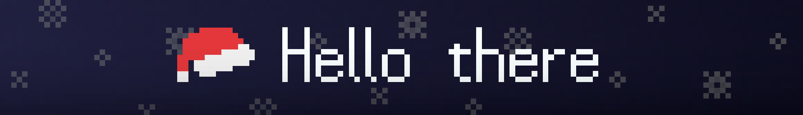

<!--

	

-->

	

Hi, i am LordOfTrident
- I enjoy programming as a hobby
- Main OS is Ubuntu
- Currently learning Go and planning to learn Rust
- I also know a little bit of Javascript

Currently working on
- [A shell for Unix/Linux systems written in Go](https://github.com/LordOfTrident/snash)
- [A stack based virtual machine in C](https://github.com/avm-collection)
- [A C++/SDL2 isometric city building game](https://github.com/LordOfTrident/city-builder)

Languages i use
  

## Github Stats

	
	

