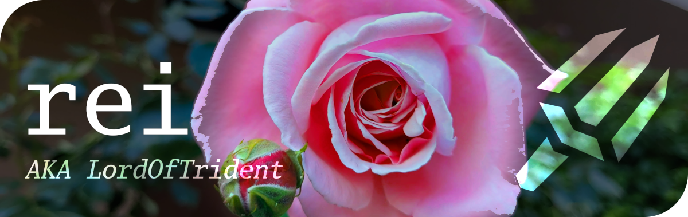

	
	

## Hi, im rei
- I enjoy programming as a hobby
- Main OS is Ubuntu
- Favorite language is probably C
- Currently learning Go and planning to learn Rust

## Github Stats

	
	

 

	
	
	
	
	
	
	
	

